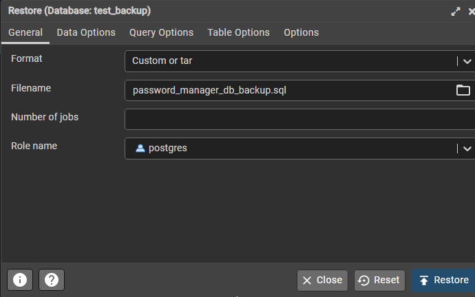

# Генератор паролей

---

Веб-Приложение, целью которого является хранение паролей пользователя.

### Стек технологий:

* back-end
  * Java (jdk version 19) 
  * Spring framework (Проект работает на spring boot) 
  * PostgreSQL (version 16) 
  * Project Lombok 
* front-end
  * HTML 
  * CSS 
  * Thymeleaf 

## Описание

Часто возникает ситуация, когда необходимо запомнить пароль от какого-то сайта и его некуда записать.
Это приложение помогает решить данную поблему. Оно позовляет удобно хранить пароли от сайтов для кадого пользователя.

### Адреса страниц приложения

* ```/auth/login``` - страница аутентификации
* ```/auth/registration``` - страница регистрации
* ```/web-info``` - страница со всеми сохранёнными сайтами пользователя
* ```/web-info/id``` - страница подробной информации о сайте
* ```/web-info/new``` - страница добавления нового сайта

##### Страницы для администраторов
* ```/people``` - страница всех пользователей
* ```/people/id``` - страница с информацией о конкнретном пользователе


## Запуск проекта

1. База данных
   1. Создайте новую базу данных в pgAdmin4
   2. Откройте окно __restore__ и выберите файл для backup 
2. Сервер
   1. Установите ___[maven](https://maven.apache.org/download.cgi)___
   2. Установите ___[jdk 19](https://www.oracle.com/java/technologies/javase/jdk19-archive-downloads.html)___
   3. Откройте терминал в папке с проектом
   4. Введите команду ```mvnw package```
   5. Перейдите в папку target
   6. Запустите сервер с помощью команды```java -jar *название jar-файла*```

---

### Сделано в личных интересах. 29.01.2024